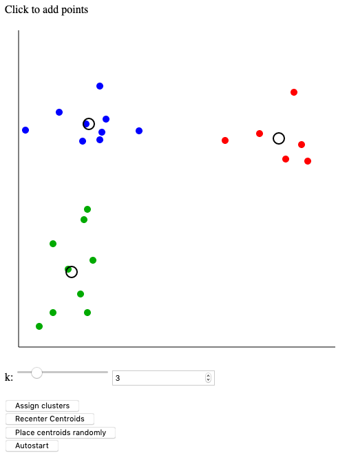

# K-Means Simulator
Provides a step-by-step visualisation of the k-means algorithm for unsupervised clustering of 2D Data. Click on the canvas to add points and choose your desired number of clusters (k). You can then run the algorithm step-by-step manually using "Assign Clusters" and "Recenter Centroids" or automatically where there's a half second delay between each step using "Autostart". "Place centroids randomly" resets the clusters and centroids.

## Required Software for Development

The javascript files are compiled using browserify.

- [NodeJS](https://nodejs.org/en/download/)
- [Browserify](http://browserify.org/): `npm install -g browserify`

## Building

- install dependencies (currently only jquery): `npm install`
- compile JS: `browserify js/main.js -o js/bundle.js`

